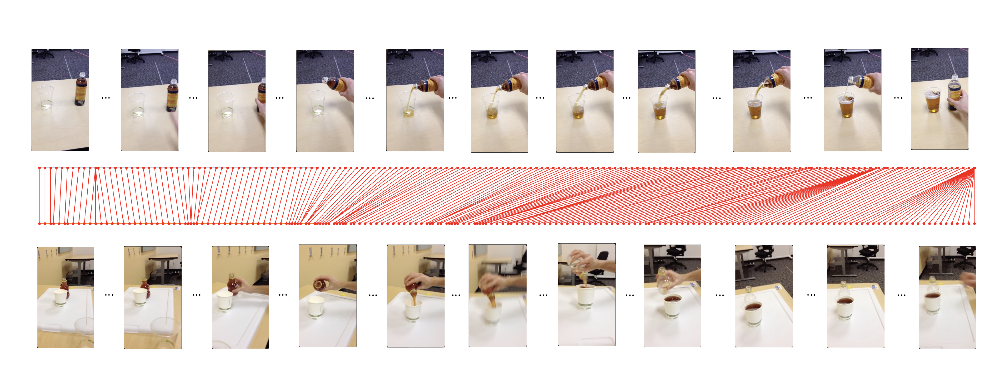

# Self-Supervised Contrastive Learning for Video Representation with Local Alignment in Expert-Learner Analysis

Keyne Oei




## Environment Setup

To setup the env,
```
git clone https://github.com/keynekassapa13/LAC.git
cd LAC
conda env create -f env.yml
conda activate lac
```

Install pip packages
```
pip install --upgrade pip
pip install -r requirements.txt
```

## Dataset

- Pouring can be downloaded [here](https://drive.google.com/file/d/14xjBRqx2xtyO0rXU2RVYGdFxyWS_Qkv5/view?usp=drive_link).
- PennAction can be downloaded [here](https://drive.google.com/file/d/1lcqHYciO68M7LVniJuZ5oOr6hsOuOPuT/view?usp=drive_link).

<pre>
.
├── datasets
│   └── pouring
│         └── train.pkl
│         └── val.pkl
│         └── videos
│   └── penn_action
│         └── train.pkl
│         └── val.pkl
│         └── videos
├── LAC
│   └── config
│         └── pouring
│         └── pennaction
│   └── dataset
│         └── ...
│   └── evaluation
│         └── ...
│   └── model
│         └── ...
│   └── utils
│         └── ...
│   └── train.py
│   └── ...
</pre>

## Train

```
cd LAC
python train.py --config='config/pouring/lac.json'
```

## Tensorboard

```
tensorboard --logdir='saved/logs' --port=6008
```